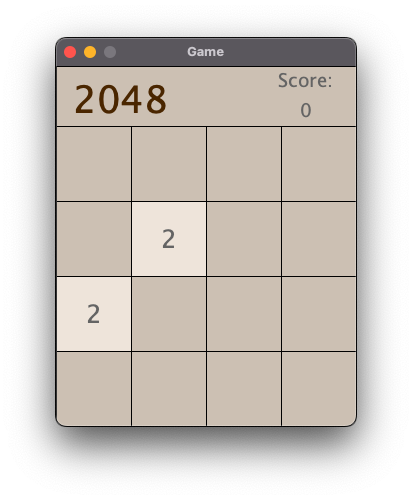
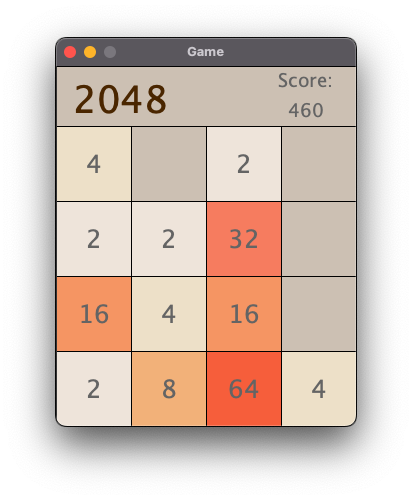
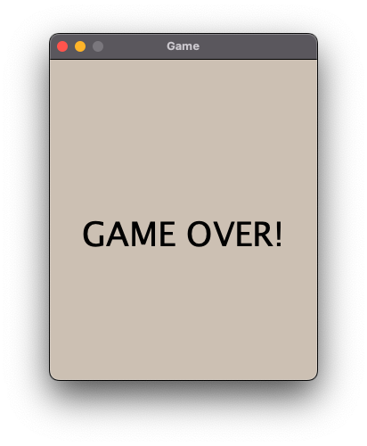
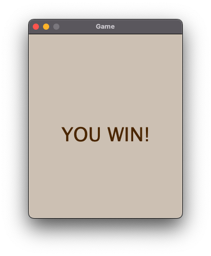

# 2048

This is a simple implementation of the classic 4-by-4 2048 tile game. The game's objective is to merge tiles
until the target tile 2048 has been created.

## Game Specifications

1. Tiles represent powers of 2, 2 being the smallest possible tile and 2048 (the target) being the largest.
2. Tiles can be shifted up, down, left, and right with their corresponding keyboard keys.
3. If the player fills the screen with tiles before creating the 2048 target tile, they loose.
4. Every time two equal-valued tiles are merged, the score increases by the outcome of the merging (ex: merging 2 and 2
   increases the score by 4).
5. After the player makes a (successful) move, a new tile (with value 2 or 4) is spawned on the game board.

## How to run the game

1. Open your terminal
2. Navigate to the `2048game` directory
3. Run the command ```./gradlew run```
4. Enjoy!

*Note:* I am using Java 8 version 1.8. I was not able to run it using different Java versions, only God knows why...

## Sneak peaks of the game

Opening screen


Oh no! So many tiles on screen!


Game over screen


Victory screen! Woohoo
